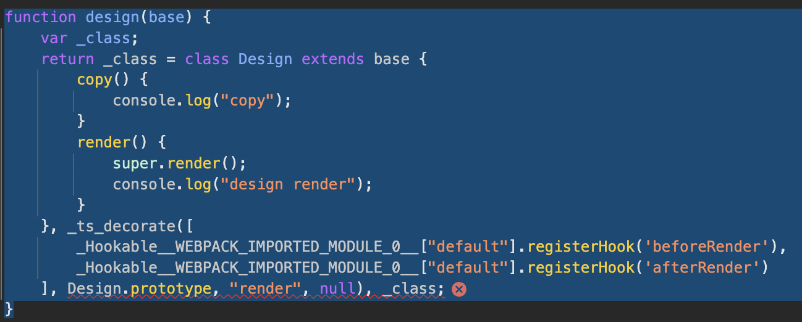

there has a problem with this code after compilation, it can not run with `decorator`

but I'm not sure the problem belongs to `rspack` or `swc-loader`

### source code 
```ts
// src/hoc/Design.ts
export default function design(base: typeof Component) {
    return class Design extends base {
        copy() {
            console.log("copy");
        }

        @Hookable.registerHook('beforeRender')
        @Hookable.registerHook('afterRender')
        render() {
            super.render();
            console.log("design render");
        }
    }
}
```

### compiled code
the `Design.prototype` parameter in `_ts_decorate` method has been used in error scope


## about `builtin:swc-loader` configs
```
{
    loader: "builtin:swc-loader",
    options: {
        jsc: {
            parser: {
                syntax: "typescript",
                decorators: true,
                tsx: true
            },
            transform: {
                react: {
                    runtime: "automatic",
                    development: isDev,
                    refresh: isDev,
                },
                legacyDecorator: true
            }
        },
        env: {
            targets: [
                "chrome >= 87",
                "edge >= 88",
                "firefox >= 78",
                "safari >= 14"
            ]
        }
    }
}
```